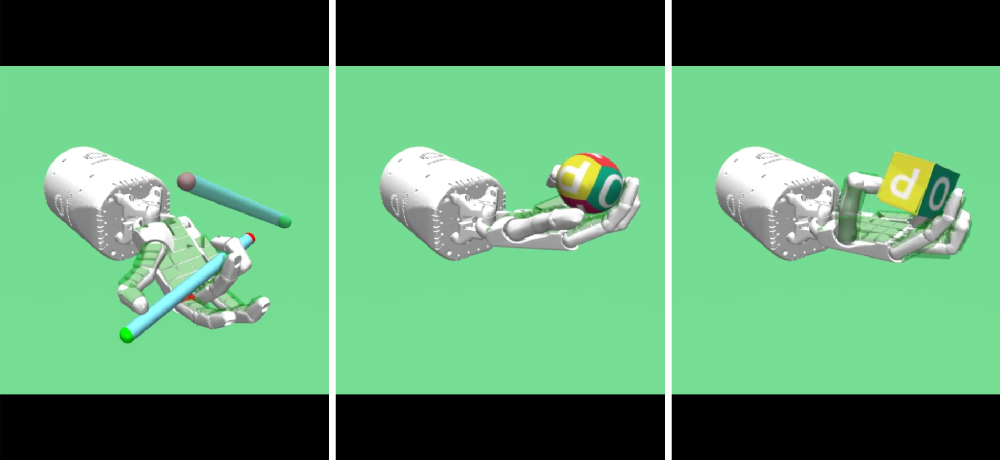
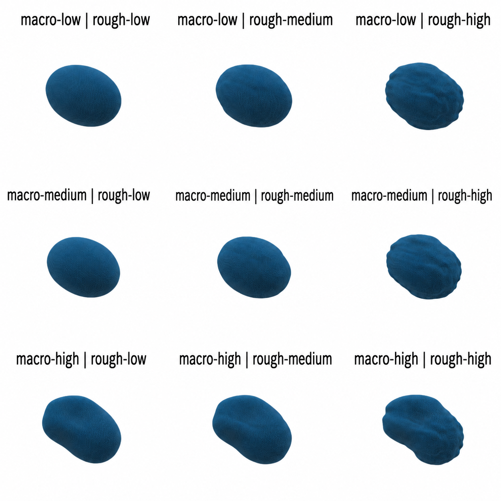

**Progress Report: Data-Driven Tactile Sensor Distribution for Robotic Manipulation**

# **1. Project Objective and Progress Overview**

Robotic tactile layouts are commonly chosen from human-hand intuition, with dense sensing at the fingertips, rather than from quantitative evidence. This project seeks to determine how the number and distribution of tactile sensors should vary with object geometry and physical behavior. The long-term outcome is a set of practical design rules that improve dexterous manipulation while avoiding unnecessary sensing hardware.

During this reporting period, we advanced from individual proof-of-concept tasks to an automated, large-scale evaluation workflow. The Shadow Hand environment now parameterizes each layout by **N**, the total number of sensors; **α**, the fraction allocated to the palm; and **β**, the fraction of the remaining sensors allocated to the fingertips (the balance is assigned to the phalanges). This representation spans palm-heavy, phalanx-heavy, fingertip-heavy, and balanced layouts while keeping comparisons reproducible.

# **2. Simulation and Training Infrastructure Completed**

We completed a programmable MuJoCo pipeline that (i) places touch sites on the hand from a candidate specification; (ii) generates self-contained environments for built-in and custom tetrahedral-mesh objects; (iii) scales object size, mass, inertia, contact radius, and spawn position consistently; and (iv) trains in-hand reorientation policies using Truncated Quantile Critics (TQC) with Hindsight Experience Replay (HER). The policy observes proprioception and touch signals and is evaluated by manipulation success over training.

The pipeline now supports both rigid and deformable objects. For compliant objects, we stabilized the simulation through conservative integration, contact, elasticity, damping, and solver settings. We also added preflight rollout checks to catch unstable environments before committing substantial compute.

{width=5.15in}

*Figure 1. Representative manipulation tasks used to validate the tactile-sensing and reinforcement-learning pipeline.*

```{=openxml}
<w:p><w:r><w:br w:type="page"/></w:r></w:p>
```

# **3. Standardized Object Study and Scalable Execution**

We constructed a controlled sphere-derived benchmark that varies object size, aspect ratio, macro-shape deformation, and surface roughness. The current manifest contains **24 object variants across four base object families**; paired rigid and deformable evaluation produces 48 conditions per sensor candidate. This design isolates how global geometry, local texture, scale, and compliance affect the value of different tactile layouts.

To run the study reliably, we implemented a distributed workflow for NSF-supported compute resources. Initial layouts are selected with space-filling Sobol sampling; subsequent layouts can be proposed through Gaussian-process Bayesian optimization. A coordinator records candidate and per-object job state, workers claim jobs according to available GPUs, and reports are exported for analysis. SLURM array and multi-node scripts were added for the completed comparison runs.

Long jobs are now more fault tolerant. Training saves model and normalization checkpoints, synchronizes experiment logs, and can resume without a stored replay buffer by collecting a controlled HER warm-up set before restarting gradient updates. Failed or incomplete jobs can be identified and resubmitted without repeating completed work. Together, these additions make the large object-by-layout comparison auditable and reproducible.

{width=2.75in}

*Figure 2. Representative structured object families. Each family is instantiated across additional sizes, aspect ratios, and physics modes for robustness testing.*

# **4. Evaluation Metrics**

For each candidate, we aggregate success over the object set using: **mean final success**, the average terminal success rate; **mean AULC**, the mean area under the learning curve; **lower-quartile final success**, the 25th percentile across objects; and **coverage at 0.5**, the fraction of objects whose final success is at least 0.5. The latter two metrics emphasize robustness and prevent a small number of easy objects from dominating the ranking.

```{=openxml}
<w:p><w:r><w:br w:type="page"/></w:r></w:p>
```

# **5. Completed Results**

All submitted SLURM evaluations were treated as complete for this progress summary. The three tested configurations produced the same ordering under every aggregate metric.

| Sensor configuration (N, α, β) | Mean final | Mean AULC | Lower-quartile final | Coverage ≥ 0.5 |
|:--|--:|--:|--:|--:|
| **(500, 0.3, 0.6)** | **0.606** | **0.344** | **0.425** | **0.600** |
| (200, 0.7, 0.5) | 0.477 | 0.219 | 0.279 | 0.467 |
| (500, 0.5, 0.2) | 0.425 | 0.193 | 0.219 | 0.400 |

*Table 1. Aggregate manipulation performance across the evaluated object set. AULC measures learning efficiency; lower-quartile performance and coverage measure robustness across objects.*

The best candidate, **(N=500, α=0.3, β=0.6)**, reached a mean final success of **0.606**, exceeding the 200-sensor candidate by 0.129 (27% relative) and the alternative 500-sensor distribution by 0.181 (43% relative). Its mean AULC was also highest, indicating faster or more sustained learning, not only a better endpoint. The 0.600 coverage means that 60% of evaluated objects achieved final success of at least 0.5.

The comparison between the two 500-sensor candidates is especially informative: holding sensor count fixed, changing the allocation from (α=0.5, β=0.2) to (α=0.3, β=0.6) improved every metric. Thus, **placement is a first-order design variable, not merely total sensor count**. The simultaneous improvement in lower-quartile performance suggests that the winning distribution is also more consistent across challenging objects.

# **6. Next Reporting-Period Activities**

Next, we will (i) complete additional Sobol/Bayesian-optimization candidates to separate count and placement effects; (ii) quantify uncertainty across objects and seeds; (iii) stratify performance by size, aspect ratio, roughness, macro-shape, and rigid/deformable physics; and (iv) validate the leading layouts on held-out object families. These analyses will support statistically defensible tactile-layout recommendations and preparation of a peer-reviewed publication.
